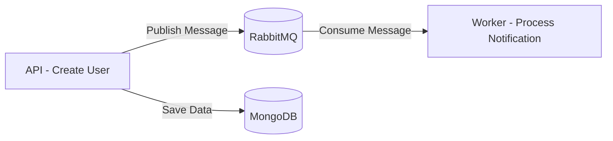

# 📨 NotificationSystem

A production-style **.NET microservices** sample demonstrating asynchronous messaging with **RabbitMQ**, built with an **API + Worker** architecture and fully containerized with **Docker**.

This project showcases practical experience with distributed systems, message queues, and clean separation of concerns — patterns commonly used in real-world backend and integration projects.

---

## 🔍 Overview

`NotificationSystem` simulates a user registration flow where:

1. A client calls the **API** to register a new user.
2. The user is persisted in **MongoDB**.
3. A notification event is published to **RabbitMQ**.
4. A dedicated **Worker** service consumes the message asynchronously and processes the notification.

This decoupled design illustrates how to build scalable, event-driven systems where the API stays responsive while background processing happens independently.

---

## 📌 Project Structure

```bash
NotificationSystem/
├── NotificationSystem.Api      # REST API for user registration and message publishing
├── NotificationSystem.Worker   # Background service that consumes and processes notifications
├── NotificationSystem.Shared   # Shared models/contracts between API and Worker
├── docker-compose.yml          # Full environment orchestration (API, Worker, RabbitMQ, MongoDB)
└── README.md
```

---

## 🚀 Tech Stack

- [.NET 8](https://dotnet.microsoft.com/) — API and Worker services
- [RabbitMQ](https://www.rabbitmq.com/) — asynchronous messaging / event broker
- [MongoDB](https://www.mongodb.com/) — user data persistence
- [Docker](https://www.docker.com/) & [Docker Compose](https://docs.docker.com/compose/) — containerized environment

---

## ⚙️ Prerequisites

- [Docker](https://www.docker.com/get-started)
- [.NET 8 SDK](https://dotnet.microsoft.com/download/dotnet/8.0) *(optional, only for running services outside Docker)*

---

## 📂 Environment

`docker-compose` provisions the entire stack with a single command:

| Service                     | Description                          | URL                              |
|------------------------------|---------------------------------------|-----------------------------------|
| **NotificationSystem.Api**   | REST API                              | `http://localhost:5001`          |
| **NotificationSystem.Worker**| Background message consumer           | —                                 |
| **RabbitMQ**                 | Message broker + management UI        | `http://localhost:15672`         |
| **MongoDB**                  | User data storage                     | internal container network       |

---

## ▶️ Getting Started

### 1. Clone the repository
```bash
git clone https://github.com/yourusername/NotificationSystem.git
cd NotificationSystem
```

### 2. Build and start the containers
```bash
docker-compose up --build
```

### 3. Access the services
- **API:** http://localhost:5001
- **RabbitMQ Management UI:** http://localhost:15672
- **Credentials:** `guest` / `guest`

---

## 📬 API Usage

### Create a user
```http
POST http://localhost:5001/api/users
Content-Type: application/json

{
  "name": "John Doe",
  "email": "john@example.com"
}
```

**What happens behind the scenes:**
- The user record is saved to MongoDB.
- A notification event is published to a RabbitMQ queue.
- The Worker service consumes the event and processes the notification asynchronously.

---

## 🛠 Communication Flow



---

## 💡 Why This Project

This repository was built to demonstrate hands-on experience with:

- Designing **event-driven, decoupled architectures**
- Implementing **producer/consumer patterns** with RabbitMQ
- Structuring multi-service **.NET solutions** with shared contracts
- Containerizing full environments with **Docker Compose**
- Writing clean, maintainable backend code following separation-of-concerns principles

Feel free to explore the source code or reach out if you'd like to discuss similar work for your project — backend APIs, message-driven systems, and microservices integrations are areas I actively work in.

---

## 📄 License

This project was built for portfolio and educational purposes. Feel free to use it as a reference or starting point.
