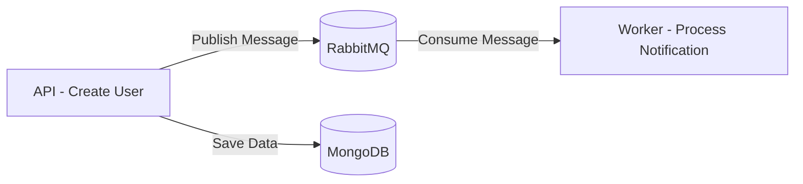

# 📨 NotificationSystem

Sample project to practice messaging with **RabbitMQ** using **.NET** (API + Worker) with Docker containers.

---

## 📌 Project Structure
```bash
NotificationSystem/
├── NotificationSystem.Api # API for user registration and sending messages to RabbitMQ
├── NotificationSystem.Worker # Worker that consumes messages from the queue and processes notifications
├── NotificationSystem.Shared # Shared classes between API and Worker
├── docker-compose.yml # Container orchestration (API, Worker, and RabbitMQ)
└── README.md
```

---

## 🚀 Technologies Used

- [.NET 8](https://dotnet.microsoft.com/)
- [RabbitMQ](https://www.rabbitmq.com/)
- [MongoDB](https://www.mongodb.com/) (user storage)
- [Docker](https://www.docker.com/)
- [Docker Compose](https://docs.docker.com/compose/)

---

## ⚙️ Prerequisites

Before running the project, make sure you have installed:

- [Docker](https://www.docker.com/get-started)
- [.NET 8 SDK](https://dotnet.microsoft.com/download/dotnet/8.0) (only if running locally without Docker)

---

## 📂 Environment Setup

The project uses `docker-compose` to start:

1. **RabbitMQ** (with management panel at `http://localhost:15672`)
2. **NotificationSystem.Api** (.NET API accessible at `http://localhost:5001`)
3. **NotificationSystem.Worker** (message processor)
4. **MongoDB** (user database)

---

## ▶️ Running the Project

### 1️⃣ Clone the repository
```bash
git clone https://github.com/yourusername/NotificationSystem.git
cd NotificationSystem
```
### 2️⃣ Start the containers
```bash
docker-compose up --build
```
### 3️⃣ Access the services
- API: http://localhost:5001

- RabbitMQ Management: http://localhost:15672
- Login: guest | Password: guest
  
---

## 📬 Testing the API
### 📌 Create a user
```bash
POST http://localhost:5001/api/users
Content-Type: application/json

{
  "name": "John Doe",
  "email": "john@example.com"
}
```
---

## 📌 When creating a user:

- It is saved in MongoDB

- A message is sent to the RabbitMQ queue

- The Worker consumes and processes the notification

---

## 🛠 Communication Flow


---

## 📄 License
This project is for study and practice purposes only. Feel free to adapt and use it as a base for your own projects.
